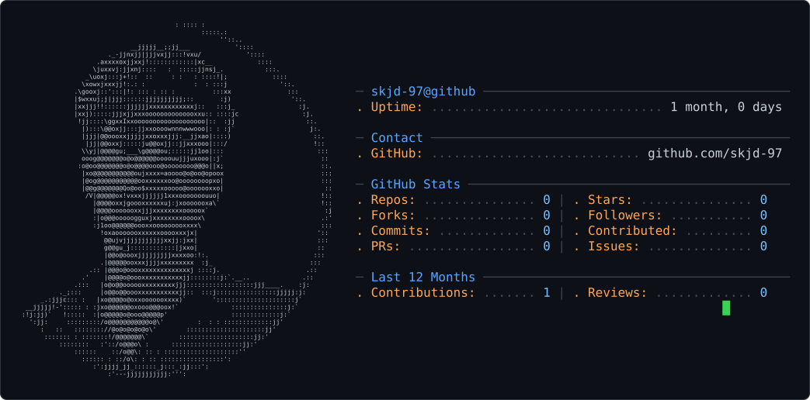

<picture>
  <source media="(prefers-color-scheme: dark)" srcset="dark_mode.svg">
  <source media="(prefers-color-scheme: light)" srcset="light_mode.svg">
  
</picture>

# 👋 Hi, I'm Javeed

### 💻 Computer Science | 🐍 Python | 🔐 Cybersecurity |  Ethical hacking 

I'm passionate about Cybersecurity, Python, Software Development and learning how technology can be used to build secure systems.

---

## 🚀 About Me

- 🔐 Interested in Cybersecurity & Ethical hacking 
- 🐍 Learning Python
- 💻 Exploring Software Development
- 🛡️ Learning Ethical Hacking concepts
- 🚀 Building practical projects
- 📚 Always learning something new

---

## 🛠️ Skills & Technologies

**Programming:** Python • HTML • CSS • SQL

**Tools:** Git • GitHub • Linux • VS Code

**Cybersecurity:** Security Fundamentals • Network Security • Web Security

---

## 🎯 2026 Goals

- 🚀 Build real-world projects
- 🔐 Improve cybersecurity knowledge
- 🐍 Improve Python skills
- 💻 Learn advanced development
- 🌟 Build a strong GitHub portfolio

---

## 📊 GitHub Stats

---

## 🤝 Connect With Me

🐙 GitHub: [@skjd-97](https://github.com/skjd-97)

---

### ⚡ Learn. Build. Secure. Repeat. 🔐
